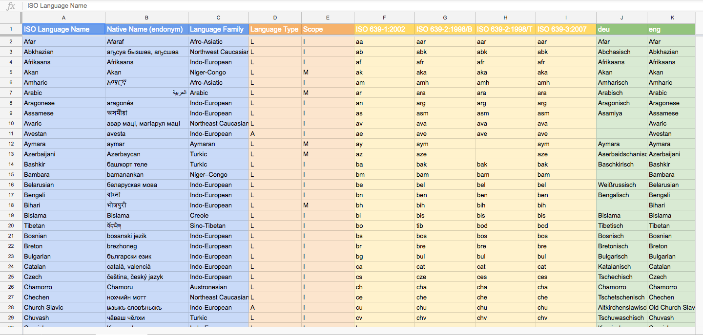

# l10n-messages
Command line utility to generate a JSON expression of the localized names of languages in the World.

## Foreword

The [Heritage Observatory](https://www.heobs.org) non-profit organization maintains a list of the localized names of languages existing in the World.

You can download the content of this list from the online sheet [Language ISO Codes](https://docs.google.com/spreadsheets/d/1BnrNVSsFbgSuP_ERyAPEZ-LFpvKYfGlREsInTjJVvr4/edit#gid=263773231). This material is licensed under the terms of the license [Creative Commons Attribution 4.0 International (CC BY 4.0)](https://creativecommons.org/licenses/by/4.0/).

You are free to:
* **Share** — copy and redistribute the material in any medium or format
* **Adapt** — remix, transform, and build upon the material for any purpose, even commercially.

The [Heritage Observatory](https://www.heobs.org) maintains two lists:

* a [complete list of the languages](https://docs.google.com/spreadsheets/d/1BnrNVSsFbgSuP_ERyAPEZ-LFpvKYfGlREsInTjJVvr4/edit#gid=263773231) in the World (8182);

* a [sub-list of the most common languages](https://docs.google.com/spreadsheets/d/1BnrNVSsFbgSuP_ERyAPEZ-LFpvKYfGlREsInTjJVvr4/edit#gid=893823414) in the World (186).
